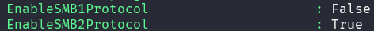

# para actualizar powersehll

```powershell
winget install --id Microsoft.Powershell --source winget
```

# Usuarios

```powershell
Get-Command *localuser*
Get-help Get-localuser -examples
```
```powershell
# inormacion de usuario
Get-LocalUser
Get-LocalUser -Name "usuario"|fl
```
```powershell
# crear usuario
New-LocalUser -Name "usuario"
# crear usuario con contraseña
$contra = Converto-SecureString "1234" -AsPlainText -Force
New-LocalUser -Name "usuario" -Password $contra
# modificar usuario
set-localuser -Name "usuario" -fullname "nombre completo"
# para que una cuenta nunca expire
Set-LocalUser -Name "usuario" -PasswordNeverExpires $true
# añadir contraseña a usuario
set-localuser -Name "usuario" -Password (Converto-SecureString "1234" -AsPlainText -Force)
# renombrar usuario
Rename-LocalUser -Name "usuario" -NewName "usuario2"
# desactivar una cuenta
Disable-LocalUser -Name "usuario"
# activar una cuenta
Enable-LocalUser -Name "usuario"
# eliminar usuario
Remove-LocalUser -confirm -Name "usuario" 
```

# Grupos

```powershell
Get-Command *localgroup*
Get-help Get-localgroup -examples
```
```powershell
Get-LocalGroup
Get-LocalGroup -Name "Administradores"|fl
```
```powershell
# crear grupo
New-LocalGroup -Name "grupo"
# modificar grupo
Set-LocalGroup -Name "grupo" -Description "descripcion"
# renombrar grupo
Rename-LocalGroup -Name "grupo" -NewName "grupo2"
# eliminar grupo
Remove-LocalGroup -confirm -Name "grupo"
# ver miebros de un grupo
Get-LocalGroupMember -Group "grupo"
# añadir usuario a grupo
Add-LocalGroupMember -Group "grupo" -Member "usuario"
# eliminar usuario de grupo
Remove-LocalGroupMember -Group "grupo" -Member "usuario"
```
```powershell
# creacion y eliminación de usuarios masiva

# Creación de un usuario
Clear
$usuario=Read-Host "Introduce nombre de usuario"
$contra=Read-Host "Introduce contraseña" -AsSecureString
New-LocalUser $usuario -Password $contra
Add-LocalGroupMember usuarios -Member $usuario

# Creación de forma masiva
#leer de fichero cvs (tener creado el fichero)
$usuarios= Import-Csv -Path C:\material\usuarios.csv
foreach ($i in $usuarios){

$clave= ConvertTo-SecureString $i.contra -AsPlainText -Force
New-LocalUser $i.nombre -Password $clave -AccountNeverExpires -PasswordNeverExpires
Add-LocalGroupMember -Group usuarios -Member $i.nombre
}

# Eliminación de usuarios de forma masiva
$usuarios= Import-Csv -Path C:\material\usuarios.csv
foreach ($i in $usuarios){
Remove-LocalUser $i.nombre
}
```

***NOTA***
PUEDE DESCARGAR LOS SCRIPTS DE CREACION DE USUARIOS MASIVA CLONANDO EL REPPSITORIO DE GITHUB
```
git clone https://github.com/AdrianCE94/PowerShell-para-administradores
```	

# Carpetas compartidas
```powershell 
#Detectar smb activado
Get-SmbServerConfiguration
#Activar smb
Set-SmbServerConfiguration -EnableSMB2Protocol $true
```


```powershell
get-command *smbshare*
get-help new-smbshare -examples
```
```powershell

# informacion de carpetas compartidas
Get-SmbShare -Special $false
Get-SmbShare -Name "nombre"|fl

# crear un recurso
new-item -Path "C:\carpeta" -ItemType Directory
New-SmbShare -Name "nombre" -Path "C:\carpeta"

# ver permisos de una carpeta compartida
Get-SmbShareAccess -Name "nombre" |fl

# crear recurso con permisos
ni -Path "C:\carpeta2" -ItemType Directory
New-SmbShare -Name "nombre2" -Path "C:\carpeta2" -FullAccess "usuario" -ReadAccess "usuario2"

# moficiar un recurso compartido
Set-SmbShare -Name "nombre" -Description "descripcion"

# cambiar conexiones simultaneas
Set-SmbShare -Name "nombre" -ConcurrenUserLimit 10 -Force
get-smbshare -Name "nombre" |fl *

# cambiar permisos 
grant-smbshareaccess -Name "nombre" -AccountName "usuario" -AccessRight Full -Force

# quitar permisos
revoke-smbshareaccess -Name "nombre" -AccountName "usuario" -Force

# denegar permisos
block-smbshareaccess -Name "nombre" -AccountName "usuario" -Force

# permitir permisos
unblock-smbshareaccess -Name "nombre" -AccountName "usuario" -Force

# eliminar recurso compartido
Remove-SmbShare -Name "nombre" -confirm
```

# Gestión de discos
```powershell
get-command *disk*
get-command *partition*
get-help get-disk -examples
```

```powershell
# info de discos
Get-Disk | fl
Get-Disk | fl number,serialnumber,HealthStatus,OperationalStatus,Size,PartitionStyle

# info de particiones
Get-Partition | fl
Get-Partition -disknumber 1

# trabajar con discos virtuales
get-windowsoptionalfeature -online -featurename microsoft-hyper-v
enable-windowsoptionalfeature -online -featurename microsoft-hyper-v

# crear disco virtual

# formato vhd y vhdx
New-VHD -Path "C:\disco1.vhd" -SizeBytes 1GB -fixed
New-VHD -Path "C:\disco2.vhd" -SizeBytes 5GB -dynamic


# montar disco
Mount-VHD -Path "C:\disco1.vhd"

# desmontar disco
Dismount-VHD -Path "C:\disco1.vhd"

# inicializar disco
Initialize-Disk -Number 1 # cambia de RAW a GPT

# cambiar de GPT a MBR
Set-Disk -Number 1 -PartitionStyle MBR

# crear particion
New-Partition -DiskNumber 1 -driveletter v

# formatear particion
Format-Volume -DriveLetter v -FileSystem NTFS

# probar
ni v:\prueba.txt

# limpiar disco
Clear-Disk -Number 1 -RemoveData

```
# automatizar creación de discos

```powershell
# uso de passtrough
mount-vhd -Path "C:\disco2.vhdx" -Passthru |
Initialize-Disk -passthru | NewPartitionSize -AssignDriveLetter -UseMaximumSize | Format-Volume -FileSystem NTFS -confirm:$false
```
```powershell
#Creación automática de un disco virtual
$disco=Read-Host "Introduce el nombre del disco (Path)"
[double]$tamano=Read-Host "Tamaño del disco en bytes"
New-VHD -Path $disco -SizeBytes $tamano -Dynamic
Mount-vhd -Path $Disco -Passthru|
Initialize-Disk -PassThru|
New-Partition -AssignDriveLetter -UseMaximumSize|
Format-Volume -FileSystem NTFS -Confirm:$false
```
***NOTA***
PUEDE DESCARGAR LOS SCRIPTS DE CREACION DE USUARIOS MASIVA CLONANDO EL REPPSITORIO DE GITHUB
```
git clone https://github.com/AdrianCE94/PowerShell-para-administradores
```	


# información de red
```powershell
get-command -module netadapter
get-commmand -module nettcpip
get-help get-netadapter -examples
```
```powershell
get-netadapter
get-netadapter -Name "Ethernet" |fl

#desactivar adaptador
Disable-NetAdapter -Name "Ethernet"

#activar adaptador
Enable-NetAdapter -Name "Ethernet"

# configuración de la red
Get-NetIPAddress 
gip
gi -InterfaceAlias "Ethernet" |fl
ipconfig
ipconfig /all
Get-NetIPAddress -InterfaceAlias "Ethernet" |fl
# info concreta
Get-NetIPAddress -InterfaceAlias "Ethernet" -AddressFamily IPv4
(Get-NetIPAddress -InterfaceAlias "Ethernet" -AddressFamily IPv4).IPAddress

# tablas de rutas
Get-NetRoute -InterfaceAlias "Ethernet" | ft -AutoSize
Get-NetRoute -InterfaceAlias "Ethernet" | ft DestinationPrefix,NextHop, InterfaceAlias -AutoSize

# dns
Get-DnsClientServerAddress -InterfaceAlias "Ethernet" |fl
resolve-dnsname www.google.es

# cache dns
Get-DnsClientCache
clear-dnsclientcache #para limpiar cache

# puertos
Get-NetTCPConnection
Get-NetTCPConnection -state Established | ft localaddress,localport,remoteaddress,remoteport, state -AutoSize

# conectividad
gip -InterfaceAlias "Ethernet"
Test-NetConnection $gateway -count 1 -quiet
Test-NetConnection www.google.es -count 1 -quiet

# script para comprobar conectividad
Clear-Host
Write-Host " ----- Conectividad -----"
#Importamos los datos
$datos= Import-Csv -Path C:\material\servidores.csv
#Recorremos los datos
    foreach ($i in $datos) {
    $respuesta=Test-Connection $i.ip -Count 1 -quiet
    if ($respuesta -eq "true") {
        Write-Host "$i Conexión establecida"
        }else {Write-Host "$i Error de conexión"}
    }

#ajustar a la necesidad de cada uno
```
***NOTA***
PUEDE DESCARGAR LOS SCRIPTS DE CREACION DE USUARIOS MASIVA CLONANDO EL REPPSITORIO DE GITHUB
```
git clone https://github.com/AdrianCE94/PowerShell-para-administradores
```	


# configurar red estática
```powershell
gip -InterfaceAlias "Ethernet"

# configurar ip
remove-netipaddress -InterfaceAlias "Ethernet" -confirm:$false
remove-netroute -InterfaceAlias "Ethernet" -confirm:$false
#$ip es la ip  que queremos
#$gateway es la puerta de enlace  que queremos
new-netipaddress -InterfaceAlias "Ethernet" -IPAddress $ip  -prefixlength 24 -DefaultGateway $gateway
Set-DnsClientServerAddress -InterfaceAlias "Ethernet" -ServerAddresses 8.8.8.8,8.8.4.4
```

# configurar red dinámica
```powershell
remove-netipaddress -InterfaceAlias "Ethernet" -confirm:$false
remove-netroute -InterfaceAlias "Ethernet" -confirm:$false
set -netipinterface -InterfaceAlias "Ethernet" -Dhcp Enabled
set-DnsClientServerAddress -InterfaceAlias "Ethernet" -ResetServerAddresses

restart netadapter -InterfaceAlias "Ethernet"

```

# automatizar configuración de red
```powershell
# Configuración de IP
# Definición de funciones
Function Get-Menu{
Clear-Host
Write-Host "Configuración IP"
Write-host "1.- IP-Fija"
Write-Host "2.- IP-DHCP"
Write-Host "3.- Salir"
}
Function Get-Adaptador {
Write-Host "Configuración de la IP"
Get-NetAdapter|ft -AutoSize
$script:interfaz = Read-Host "Introduzca la interfaz (IfIndex)"
$script:nombre = Read-Host "Introduzca el nombre (name)"
#Borramos datos
Remove-NetIPAddress -InterfaceIndex $interfaz -Confirm:$false
Remove-NetRoute -InterfaceIndex $interfaz -Confirm:$false
}
Function Ip-Fija {
Get-Adaptador
#Creamos la nueva IP
$ip = Read-host "Introduzca IP"
$mascara = Read-Host "Introduca la máscar (nºs de unos)"
$gateway = Read-Host "Introduzca el gateway"
$dns1 = Read-host "Introduzca el primer DNS"
$dns2 = Read-host "Introduzca el segundo DNS"
New-NetIPAddress -InterfaceIndex $interfaz $ip -PrefixLength $mascara -DefaultGateway $gateway
Set-DnsClientServerAddress -InterfaceIndex $interfaz -ServerAddresses ("$dns1","$dns2")
Restart-NetAdapter -Name $nombre
}
Function IP-Dhcp {
Get-Adaptador
#Establecemos IP por Dhcp
Set-NetIPInterface -InterfaceIndex $interfaz -Dhcp enabled
Set-DnsClientServerAddress -InterfaceIndex $interfaz -ResetServerAddresses
#Restablecer el interfaz
Restart-NetAdapter -Name $nombre
}
#Inicio
do{
Get-Menu
$opcion = Read-Host "Elija una opción"
switch ($opcion){
'1'{Ip-Fija}
'2'{IP-Dhcp}
'3'{exit}
Default {Write-Host "Opción incorrecta"}
}
$intro = Read-Host "Pulse intro para continuar"
}while ($true)
```

> [!NOTE]
PUEDE DESCARGAR LOS SCRIPTS DE CREACION DE USUARIOS MASIVA CLONANDO EL REPPSITORIO DE GITHUB

```git
git clone https://github.com/AdrianCE94/PowerShell-para-administradores
```	
# Procesos
```powershell
# comandos de procesos
get-command *process*
get-help get-process -examples
```
```powershell
# ver procesos	
Get-Process
# buscar un proceso que más consume
Get-Process | Sort-Object -Property CPU -Descending | Select-Object -First 5
# buscar un proceso concreto
Get-Process -Name "chrome" | fl *
# path
(Get-Process -Name notepad).path
 #tamaño
(Get-Process -Name notepad).ws/1mb
# parar un proceso
Stop-Process -Name "chrome" -confirm
# parar un proceso por id
Stop-Process -Id 1234 -confirm
# iniciar un proceso
Start-Process -FilePath "C:\Windows\notepad.exe"
# iniciar una app
Start-Process Ms-clock://
```

# Servicios
```powershell
# comandos de servicios
get-command *service*
get-help get-service -examples
```
```powershell
# ver servicios
Get-Service
# ver servicios en ejecución
Get-Service | Where-Object -Property Status -eq "Running"
# buscar un servicio concreto
Get-Service -Name "bits" | fl *
# parar un servicio
Stop-Service -Name "bits" -confirm
# iniciar un servicio
Start-Service -Name "bits"
# servicios requeridos y dependientes
Get-Service -RequiredServices -Name "bits"
Get-Service -DependentServices -Name "bits"

# modificar un servicio (descripcion,displayname,startuptype,status)
Set-Service -Name "bits" -Description "servicio de transferencia inteligente en segundo plano"
```

# Programación de tareas
```powershell
get-command *scheduledtask*
get-help new-scheduledtask -examples
```
```powershell
# ver tareas programadas
Get-ScheduledTask
# ver tareas programadas concreta
Get-ScheduledTask -TaskName "tarea" | fl *
# ver parametros importantes
Get-ScheduledTask -TaskName "tarea" | fl Actions,Triggers,State
(Get-ScheduledTask -TaskName "tarea").Actions
(Get-ScheduledTask -TaskName "tarea").Triggers

# creacion de tarea programada
 # acciones
 # triggers
 # crear tarea programada